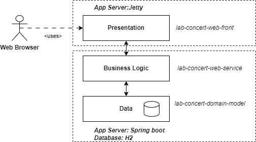

Lab - Three-tier Web Application Development
==========

Before you start
----------
The purpose of this lab is to reinforce and build upon the course material, gaining more practice to 3tier architecture of web application. This lab is divided into 2 exercises. The first exercise is to develop a rest service that connect to database using JPA. The second exercise is to develop a front web application that consume the rest service. The lab is based on the previous lab spring boot and the lab JPA .

Begin by cloning this repository onto your local machine.
:octocat: :octocat: Follows the same guideline as last lab to import subproject `lab-concert-domain-model`, `lab-concert-web-service` and `lab-concert-web-front`

Exercise 1 - Concert Web service with JPA
----------
This exercise develop rest-based services that connect database through JPA framework.
#### (a) Complete the domain model
In `lab-concert-domain-model`, the `Concert` and `Performer` class are included. This project serves database to the system using JPA. You need to add annotations to these classes, similar to `lab-concert-database` in the previous lab (week 4). You may follows the following guideline:
- add `@Entity` to the entity class.
- add `@Id` and `@GeneratedValue` to the attribute that will be used as primary key.
- add relationship annotation to an attribute that link to the other class such as `@ManyToOne` with proper `fetch` and `cascade`  so that when concert is saved, performer is also saved if not existed. When concert is removed, its performer is removed when it is no longer associated to any concert.

The object of these classes should be used to exchange between client and rest service in JSON format. So, please remember to pay attention on some attribute that are date/datetime such `getDate()` as  `@JsonSerialize` and `@JsonDeserialize` may need to be added (Please search on the internet how to use it).

If you have done it correctly, please run the testing for `lab-concert-domain-model` using maven's `verify` goal. All test should pass.

#### (b) Complete the rest service
The `lab-concert-web-service` contains the source code of rest services, smilar to what we have done in `lab rest` (week 3). You have to complete these services using JPA API to connect to database created by `lab-concert-domain-model` project.

The service is to provide a basic REST interface as follows:

- `GET /concerts/{id}`. Retrieves a representation of a `Concert`, identified by its unique ID. The HTTP response message should have a status code of either 200 (OK) or 404 (File not found), depending on whether the specified concert is found.

- `GET /concerts`. Retrieves all `Concert`s. The HTTP response message should have a status code of 200 (OK) on success.

- `POST /concerts`. Creates a `Concert`. The body of the HTTP request message contains a representation of the new concert (other than the unique ID) to create. The service generates the concert's ID via the database, and returns a HTTP response of 201 (created).
  
- `PUT /concerts`. Updates an existing `Concert`. A representation of the modified concert is stored in the body of the HTTP request message. Being an existing concert that was earlier created by the Web service, it should include a unique ID value. The HTTP status code should be 204 on success, or 404 where the concert isn't known to the Web service.

- `DELETE /concerts/{id}`. Deletes a `Concert`, where the concert to delete is specified by a unique ID. This operation returns either 204 (no content) or 404, depending on whether the concert exists.

- `DELETE /concerts`. Deletes all `Concert`s, and returns a 204 (no content) status code.

##### In `ConcertApplication.java`, modify the following
:smiley_cat: Develop a typical Spring boot application. You may look at the lab-boot as an example. You will need to define where Spring can find entity classes using @EntityScan( basePackages = {"......."} )

##### In `ConcertController.java`, modify the following:
Please follow `TODO` in the source code of this class to complete the services. Also read the reference below for a guideline.

:grin::grin:** Running the maven's verify at `lab-concert-web-service` may result in failure, as the project need the database to run, please run at the parent project `lab-3tier`**

#### (c) Build and Test the project
The class `ConcertResourceIT` can be used to run the integration test. You can also build and run maven `verify` as usual at parent project `lab-3tier`.

Exercise 2 - Develop Front Web Application
----------
The `lab-concert-web-front` contains the source code of front web application. 

#### (a) Complete the front web application
The front-web uses jetty as a webserver to simply host html pages. You have to complete HTML code in `concert.html` (located at `src/main/webapp/`) to display the concert information and add concert. Please follow `TODO` in the source code to complete the application. 
- complete `createConcertForm` in `concert.html` to display the form to add concert. The form should have the following fields with proper type as shown in ():
  - `title` (text)
  - `date` (datetime-local)
  - `performer's name` (text)
  - `performer's image URL` (text)
- complete `loadConcerts` method in `concert.html` to load all concerts from the rest service. The concerts should be loaded from `GET /concerts` and displayed in the div `concertList` that shows concert's information. You may simply use `
` tag to display the information.
- complete the function that is triggered when `createConcertForm` is submitted to send the concert information to the rest service. The form should be sent to `POST /concerts` with proper JSON format. 

#### (b) Run the project
Please perform the following
- run the rest service at `lab-concert-web-service` using run button in ConcertApplication.
- run the front web application at `lab-concert-web-front` using maven with goal `jetty:run`.
- open browser and go to `http://localhost:8081/concert.html` to see the result. try to add a new concert and see if is added to the list.

***Please ask TA to confirm that you have complete the application correctly***
 
#### Do not forget to Commit and Push code to github